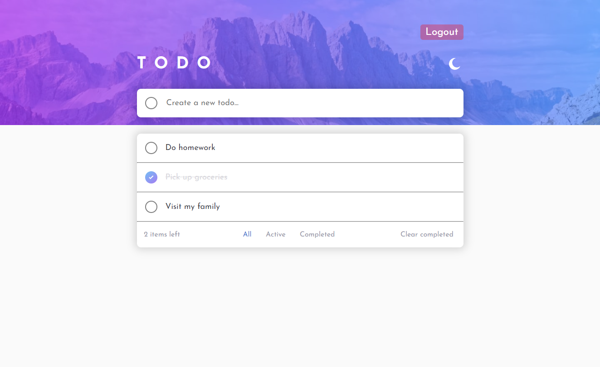
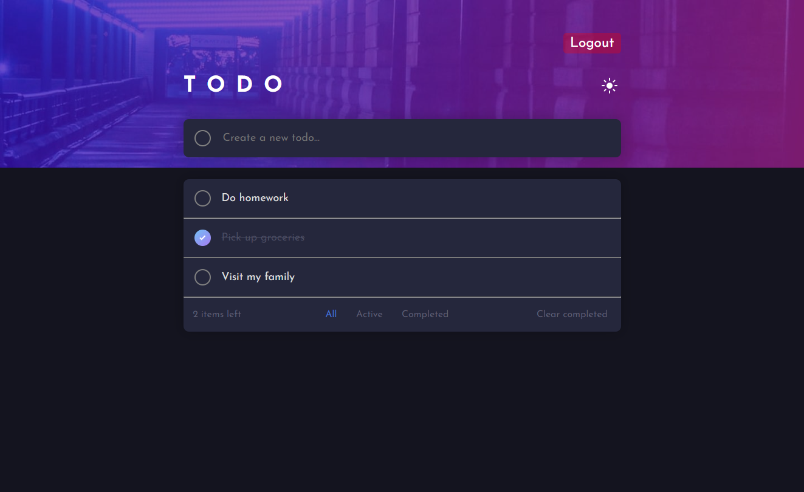

# Frontend Mentor - Todo app solution

This is a solution to the [Todo app challenge on Frontend Mentor](https://www.frontendmentor.io/challenges/todo-app-Su1_KokOW). Frontend Mentor challenges help you improve your coding skills by building realistic projects.

## Table of contents

-   [Overview](#overview)
    -   [The challenge](#the-challenge)
    -   [Screenshot](#screenshot)
    -   [Links](#links)
-   [My process](#my-process)
    -   [Built with](#built-with)
    -   [What I learned](#what-i-learned)
    -   [Continued development](#continued-development)
    -   [Useful resources](#useful-resources)
-   [Author](#author)
-   [Acknowledgments](#acknowledgments)

## Overview

### The challenge

Users should be able to:

-   **(Extra)** Register and login with username and password
-   View the optimal layout for the app depending on their device's screen size
-   See hover states for all interactive elements on the page
-   Add new todos to the list
-   Mark todos as complete
-   Delete todos from the list
-   Filter by all/active/complete todos
-   Clear all completed todos
-   Toggle light and dark mode

### Screenshots

### Links

-   Live Site URL: [Github Pages](https://cvenencia.github.io/todo-app-main)
-   API URL: [Heroku](https://cvenencia-todo-app.herokuapp.com)
-   Database hosting: [MongoDB Atlas](https://www.mongodb.com/es/atlas/database)

## My process

### Built with

-   Front-end: React.
-   Back-end: Express and MongoDB.
